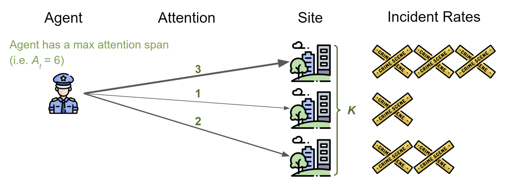
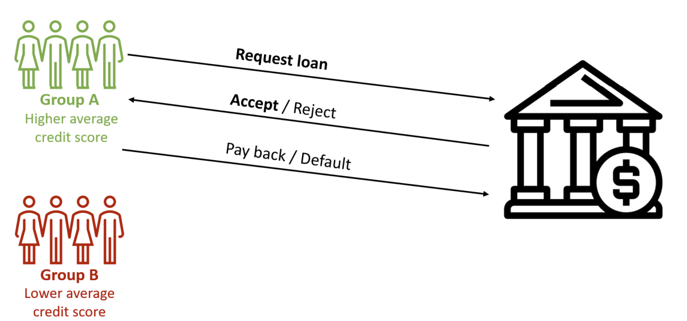
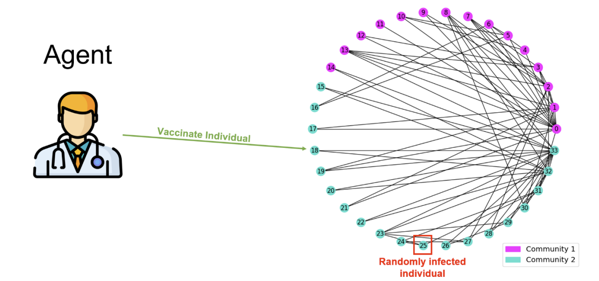

# Policy Optimization with Constraint Advantage Regularization (POCAR)

- **Policy Optimization with Advantage Regularization for Long-Term Fairness in Decision Systems** \
Authors: Eric Yang Yu, Zhizhen Qin, Min Kyung Lee, Sicun Gao \
NeurIPS (Conference on Neural Information Processing Systems) 2022

This is the code implementation for the NeurIPS 2022 [paper](https://arxiv.org/abs/2210.12546) above. 
Code and environments are adapted from the original Google ML-fairness-gym [repo](https://github.com/google/ml-fairness-gym).

# Installation
First, install [Anaconda](https://docs.anaconda.com/anaconda/install/) to set up virtual environment.

To use `python 3.8`, run:
```
conda create -n pocar python=3.8
conda activate pocar
pip install -r requirements_py38.txt
```

To use `python 3.7`, run:
```
conda create -n pocar python=3.7
conda activate pocar
pip install -r requirements_py37.txt
```

# Usage
First, `cd` to an experiment directory. Then, to train:
```
python main.py --train
```

To view training progress:
```
python main.py --show_train_progress
```

To evaluate models (make sure to specify model paths to evaluate in config.py):
```
python main.py --eval_path ./path/to/evaluations/
```

To view model evaluations:
```
python main.py --display_eval_path ./path/to/evaluations/
```


# Environments
## Attention Allocation


## Lending


## Vaccination / Infectious Disease Control


# Bibtex
```
@misc{https://doi.org/10.48550/arxiv.2210.12546,
  doi = {10.48550/ARXIV.2210.12546},
  url = {https://arxiv.org/abs/2210.12546},
  author = {Yu, Eric Yang and Qin, Zhizhen and Lee, Min Kyung and Gao, Sicun},
  keywords = {Machine Learning (cs.LG), Artificial Intelligence (cs.AI), Computers and Society (cs.CY), FOS: Computer and information sciences, FOS: Computer and information sciences},
  title = {Policy Optimization with Advantage Regularization for Long-Term Fairness in Decision Systems},
  publisher = {arXiv},
  year = {2022},
  copyright = {Creative Commons Attribution 4.0 International}
}
```